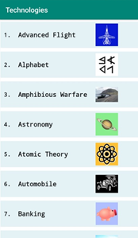
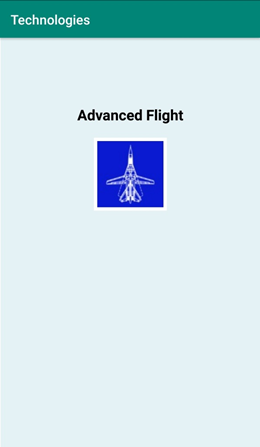
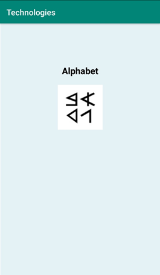

# RPP_2
В данной лабораторной работе требуется реализовать список технологий из JSON-файла и картинок.

При запуске приложения начинается считывание данных из JSON-файла, содержимое которого конвертируется в текстовый формат и отправляется во второе активити со списком. Для считывания данных из JSON-файла написана функция, которая сначала с помощью AssetManager-а записывает данные из файла в буфер, а затем возвращает эти данные в качестве текстового формата.
Второе активити состоит из списка фрагментов. Эти фрагменты состоят из картинки, номера технологии и имени технологии. Для этих элементов написаны отдельные классы, преобразующие данные JSON-файла в данные для показа пользователю. При нажатии на элемент списка открывается ViewPager и, согласно условию, при свайпе влево и вправо содержимое ViewPager-а меняется.
# Скриншоты программы:

Список технологий:

При нажатии на элемент списка:

При свайпе влево:

